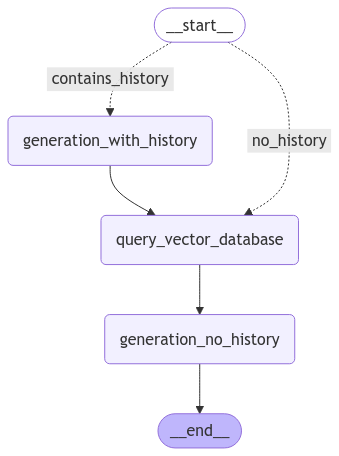

# LangGraph deployment examples on Databricks

This repository provides two example implementations of LangGraph application deployments on Databricks. One example uses MLflow's [langchain flavor](https://mlflow.org/docs/latest/python_api/mlflow.langchain.html#mlflow.langchain.log_model) for logging; the other uses [ChatModel](https://mlflow.org/docs/latest/llms/chat-model-intro/index.html).

LangGraph applications require a post processing step to format the graph's state (a dictionary) into an MLflow chat model response type. For batch inference, the response type is [ChatCompletionResponse](https://mlflow.org/docs/latest/python_api/mlflow.types.html#mlflow.types.llm.ChatCompletionResponse); for streaming, yielding instances of [ChatCompletionChunk](https://mlflow.org/docs/latest/python_api/mlflow.types.html#mlflow.types.llm.ChatCompletionChunk) is required.

These langgraph implementations are based on Databricks dbdemos advanced [RAG example](https://www.databricks.com/resources/demos/tutorials/data-science-and-ai/lakehouse-ai-deploy-your-llm-chatbot?itm_data=demo_center). See the folder, **03-advanced-app** and notebook, **02-Advanced-Chatbot-Chain**. This repo contains a langgraph equivalent (roughly) of the demo's LangChain Expression Language (LCEL) implementation. Download the dbdemos notebooks and run the data preprocessing and vector index provisioning notebook (01-PDF-Advanced-Data-Preparation). The vector search index created by this notebook is a requirement for the code in this repository.

You will need to update the resources names in the config.yaml file to match those in your Databricks Workspace. You can include any parameters in this file that would be helpful for iterating over to test different application configurations.

The workflow receives input messages and checks to see if historical messages (prior interactions between the user and model) exist. If they do, the model is prompted to rewrite the user's current question to include relevent context from prior interactions. The reframed question is then used to query the vector database. If there were no historical messages, the query is based on the user's precise question.
Finally, the context from the vector database, and either the users's question or model's reframed question format a prompt, and the final model call return the answer.

### Useful info

 - This repo uses mlflow's [models from code](https://mlflow.org/docs/latest/model/models-from-code.html) approach to logging.
 - The [graph definitions](https://langchain-ai.github.io/langgraph/reference/graphs/#graph-definitions) in the LangGraph documentation are helpful for understanding the options for constructing workflows.
 - This project logs supporting scripts with the model using code_paths. There are some [limitations to be aware of](https://mlflow.org/docs/latest/model/dependencies.html#caveats-of-code-paths-option) that matter for how the project is structure. This project was originally formatted in a different way, but the directory structure could not be reflected within the MLflow model artifacts.
 - LangGraph has various streaming modes; each mode returns a different type of event. The [astream_events](https://langchain-ai.github.io/langgraph/how-tos/streaming-events-from-within-tools/#using-stream-events-api) is interesting because it includes so much information about each nodes execution, but mlflow models / serving does not support async from my understanding. This repo uses [stream](https://langchain-ai.github.io/langgraph/concepts/streaming/#streaming), which has some implications for the way the graph's state is defined: it returns only a nodes output, rather than the entire updated state. With streaming, the application can return information to the user during node executions, thus providing some feedback during intermediate steps. This could be a nice feature for more complex, longer running graphs.
 - Our [documentation](https://docs.databricks.com/en/generative-ai/agent-framework/agent-schema.html#define-an-agents-input-and-output-schema) on agent input and output schema.